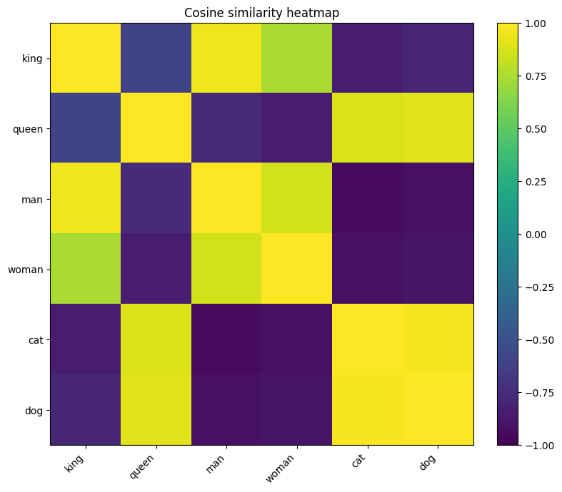

# Word2Vec (NumPy) - JetBrains Test Task

This project implements **Skip-gram with Negative Sampling (SGNS)** for an internship programming task.

## What Is Implemented

- Data loading from `wikitext-2-raw-v1`
- Text normalization and tokenization
- Vocabulary building and ID encoding
- Skip-gram pair generation
- Negative sampling with unigram^0.75 distribution
- Full SGNS optimization loop:
   - forward pass
   - loss computation
   - backward gradients
   - parameter updates
- Checkpoint saving (`W_center.npy`, `W_context.npy`) and training records

## Methodology

This project trains a NumPy implementation of **Skip-gram with Negative Sampling (SGNS)** on the local `wikitext-2-raw-v1` corpus.

For a step-by-step mathematical derivation of the SGNS objective and gradients, see [docs/sgns_derivation.md](docs/sgns_derivation.md).

The current training pipeline is:

1. normalize and tokenize raw WikiText-2 lines
2. build a capped vocabulary with `min_freq` / `max_vocab_size`
3. apply frequent-word subsampling
4. encode tokens with the exact run-specific vocabulary
5. generate skip-gram pairs with a configurable context window
6. train SGNS with unigram^0.75 negative sampling
7. monitor both training loss and periodic validation loss during training

Important implementation choices:

- training is done from scratch in pure NumPy
- `W_center` and `W_context` are both saved for each run
- `vocab.json` is saved inside each checkpoint run for reproducible evaluation
- post-training visualization can use `center`, `context`, or their mean, but qualitative checks should still include `W_center`

## Analysis

The experiments can be summarized in three stages.

### Stage 1: Early Failure Mode

The earliest runs showed that subsampling and vocabulary control were not optional details. Without them, the embedding space was strongly dominated by high-frequency words, which made nearest-neighbor outputs difficult to trust.

`model_1`, an early no-subsampling run, illustrates this issue clearly. The figure below is included as a diagnostic example rather than as a benchmark result.


Observation:

- the space is not cleanly separated into intuitive semantic groups
- several words that should feel more distinct still occupy a broadly mixed layout
- this was an early indication that frequent-word dominance had to be addressed before nearest-neighbor analysis could be trusted

### Stage 2: Improved Pipeline, But Imperfect Semantics

The heatmap below comes from a smaller custom notebook probe created after `subsampling` had already been introduced into the training pipeline. It uses:

- `king`, `queen`, `man`, `woman`
- `cat`, `dog`

It is useful as an **analysis figure**, not as a headline result. It shows that the model has learned some local structure, but it also highlights where semantic organization remains unstable.

Observation:

- `king` is close to `man`, and `cat` is close to `dog`, which suggests that some local structure has been learned
- however, the royalty cluster is still not cleanly separated from the animal pair
- this indicates that broad contextual similarity is still interfering with cleaner lexical semantics



This stage showed that lower SGNS loss was informative, but not sufficient as a stand-alone quality criterion. Even after the training pipeline improved, nearest neighbors, analogy probes, PCA/t-SNE, and cosine heatmaps remained necessary as complementary diagnostics.

### Stage 3: Later Run Comparison


`model_3`, the most recent completed run in the current training pipeline, improved training stability relative to `model_2`, the earlier warm-start run. Under the newer setup, the model no longer exhibited the same near-constant cosine pattern seen in `model_2`, where many unrelated `W_center` neighbors clustered around `0.999`. This indicates that `model_3` moved away from the clearest collapse-type failure mode and produced a space that is easier to inspect.

However, the qualitative result is still not fully satisfactory. In `model_3`, representative `W_center` neighbors such as `king -> used, series, said, first, known` remained too generic. `model_3` therefore improved stability without fully resolving the tendency toward broad-context or frequency-driven neighborhoods.

Overall conclusion:

- the project now produces embeddings that are easier to inspect and compare than the earliest runs
- the most recent pipeline is a real improvement over the strongest collapse-type failure modes
- however, the learned space still shows substantial frequency bias and generic-context bias, so qualitative diagnostics remain necessary

For a short write-up of the training journey, major experiment pivots, and why some runs were useful even when the embeddings were still imperfect, see [docs/training_journey.md](docs/training_journey.md).


## Get Started

For a quick interactive demo of the learned embeddings, open the notebook:

```bash
jupyter notebook demo_word2vec_results.ipynb
```

Use the notebook for exploratory analysis, custom word probes, analogy checks, and small diagnostic heatmaps.

### Quick Start

Clone the repository and navigate into it:

```bash
git clone https://github.com/TUe-Ray/Word2Vec
cd Word2Vec
```

### Installation

1. Create and activate an environment.

Windows (PowerShell):
```powershell
python -m venv .venv
.venv\Scripts\Activate.ps1
```

Linux/macOS:
```bash
python -m venv .venv
source .venv/bin/activate
```

2. Install dependencies.
```bash
pip install -r requirements.txt
```

### Prepare Dataset

Download and cache WikiText-2 raw dataset:
```bash
python download_dataset.py
```

Expected output folder:
- `data/wikitext-2-raw-v1/`

## Training

Run training from the project root:
```bash
python train.py
```

Main hyperparameters are defined in `train.py` under `hyperparams`.

The default training configuration now includes frequent-word subsampling via `subsample_threshold`.
Set it to `0` if you want to disable subsampling for an ablation run.

The training loop also supports periodic validation tracking:

- `validation_split`: usually `validation`
- `validation_every`: evaluate validation loss every N training steps
- `validation_max_sentences`: cap validation sentences for faster monitoring

To load start weights from an existing checkpoint, pass a run id via CLI:

```bash
python train.py --start-weight-run-id 20260314_191627
```

Optional: choose checkpoint type (`latest` or `final`):

```bash
python train.py --start-weight-run-id 20260314_191627 --start-weight-subdir final
```

If `--start-weight-run-id` is not provided, training starts from fresh random initialization.
If the folder or files are missing, training also falls back to fresh random initialization.

## Outputs

Each run creates a timestamped folder at `checkpoints/<run_id>/` containing:

- `run_config.json`
   Stores training hyperparameters and checkpoint interval.

- `vocab.json`
   The exact vocabulary used during training for that run.

- `latest/`
   Contains `W_center.npy` and `W_context.npy` for the periodically updated checkpoint.

- `best/`
   Contains the checkpoint with the best validation loss seen so far during training.

- `final/`
   Contains `W_center.npy` and `W_context.npy` for the final trained embeddings.

- `loss_history.csv`
   Per-step training loss.

- `validation_loss_history.csv`
   Periodic validation loss measured during training.

- `training_loss.png`
   Training and validation loss visualization.

- `run_summary.json`
   Final/best training loss, final/best validation loss, total steps.

## Load Saved Embeddings (for Eval/Inference)

This section is for loading embeddings after training (for evaluation or analysis).
For warm-start training, use the CLI flags in the **Training** section.

Example:
```python
from src.train.model import SkipGramModel

model = SkipGramModel(vocab_size=50000, embedding_dim=1024)
model.load_embeddings("checkpoints/<run_id>/final")

# Input (center) embeddings
W_in = model.W_center
# Output (context) embeddings
W_out = model.W_context
```

Note: `vocab_size` and `embedding_dim` passed to `SkipGramModel` must match the saved checkpoint.

## Visualization

The core SGNS training loop is implemented in pure NumPy. scikit-learn is used only for post-training visualization utilities (PCA/t-SNE), not for model training.

The visualization script is still useful when you want reproducible, non-interactive outputs written directly from the command line, especially for comparing multiple runs or regenerating plots without opening Jupyter.

Use the visualization script to inspect trained embeddings with PCA, t-SNE, and a cosine similarity heatmap:

```bash
python -m src.eval.visualize_embeddings --run-id 20260314_191627 --checkpoint-subdir latest
```

By default, the script:

- loads the requested checkpoint run
- rebuilds the matching vocabulary from `run_config.json` if `checkpoints/<run_id>/vocab.json` does not exist yet
- uses the mean of `W_center` and `W_context`
- prefers a curated set of representative nouns, verbs, and adjectives, then fills the remainder with frequent words
- writes outputs to `checkpoints/<run_id>/visualizations/`

Example with specific words:

```bash
python -m src.eval.visualize_embeddings --run-id 20260314_191627 --checkpoint-subdir latest --words king queen man woman city london paris
```

Useful flags:

- `--embedding-source center|context|mean`
- `--num-words 120`
- `--annotate-limit 40`
- `--heatmap-limit 30`

## Evaluation

Use `src/eval/eval.py` to measure held-out SGNS loss on validation/test splits and inspect nearest neighbors:

```bash
python -m src.eval.eval --run-id 20260314_191627 --checkpoint-subdir latest
```

This writes evaluation outputs to `checkpoints/<run_id>/evaluation/`:

- `heldout_loss_summary.json`
- `nearest_neighbors_mean.json` (or `center/context` depending on `--embedding-source`)

Example with custom query words:

```bash
python -m src.eval.eval --run-id 20260314_191627 --checkpoint-subdir latest --query-words king queen london paris --top-k-neighbors 10
```

For faster iteration during tuning, you can evaluate only the first part of each split:

```bash
python -m src.eval.eval --run-id 20260314_191627 --checkpoint-subdir latest --eval-splits validation --max-sentences 200
```

## Known Limitations

- Lower SGNS loss does not automatically imply better semantic neighborhoods. Held-out loss and qualitative embedding quality can diverge.
- The mean of `W_center` and `W_context` is not always the best semantic representation. In some runs it can hide, distort, or cancel useful structure.
- High-frequency words can still dominate the geometry of the space through hubness and broad contextual overlap, even when subsampling is enabled.
- Token filtering and vocabulary design still matter a lot. Small preprocessing changes can noticeably affect both validation loss and qualitative results.
- No word similarity or analogy benchmark dataset integration yet.
- Qualitative evaluation is still partly manual. The project does not yet include an automatic semantic early-stopping signal.
- Training is implemented for clarity and correctness, not maximum speed.
- The current script reads all generated skip-gram pairs in memory.

