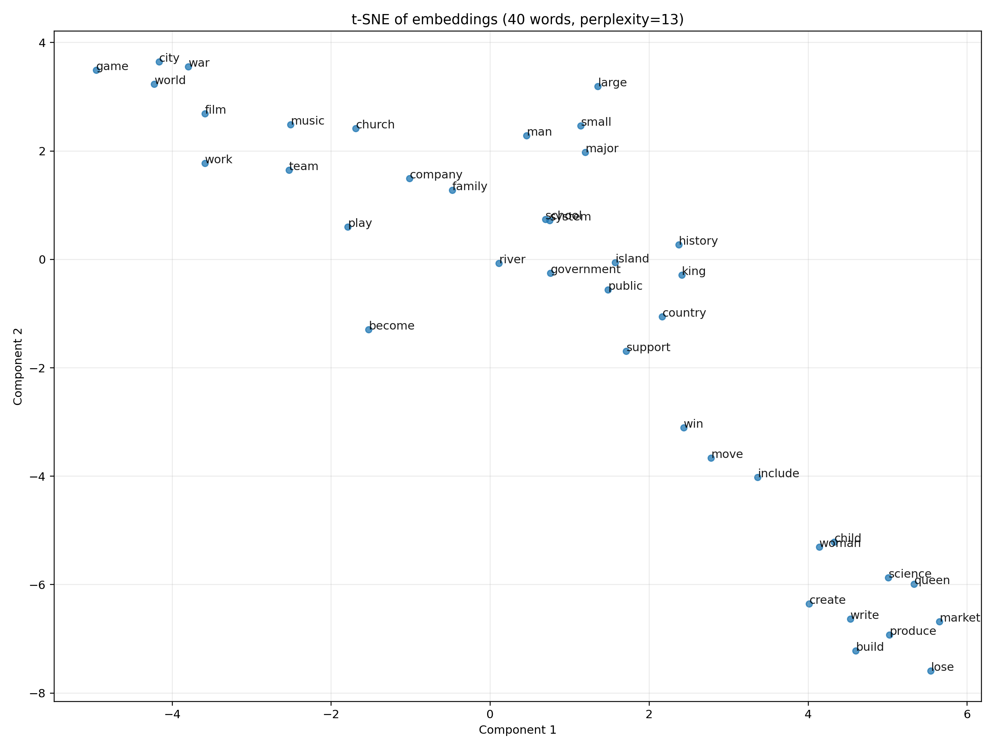
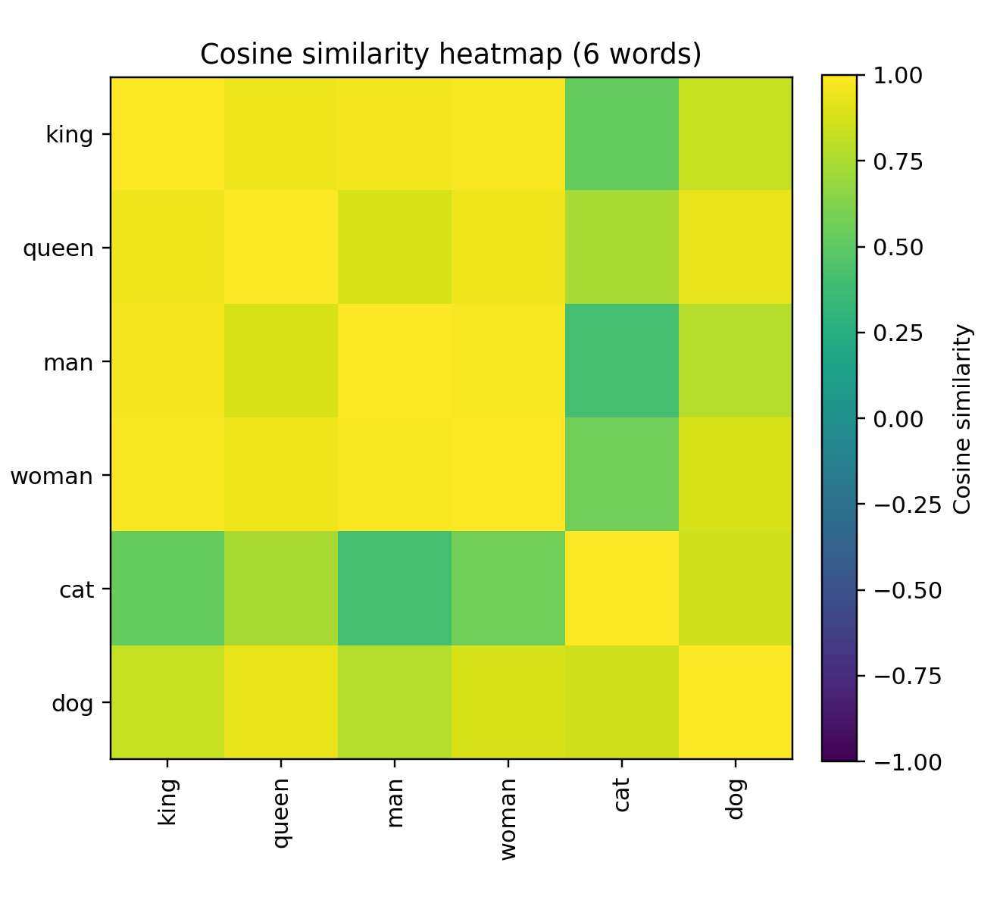
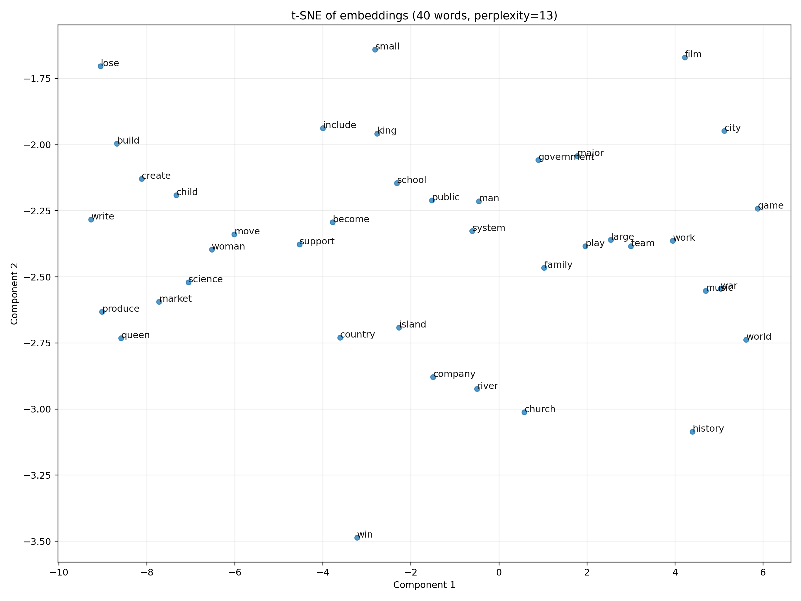
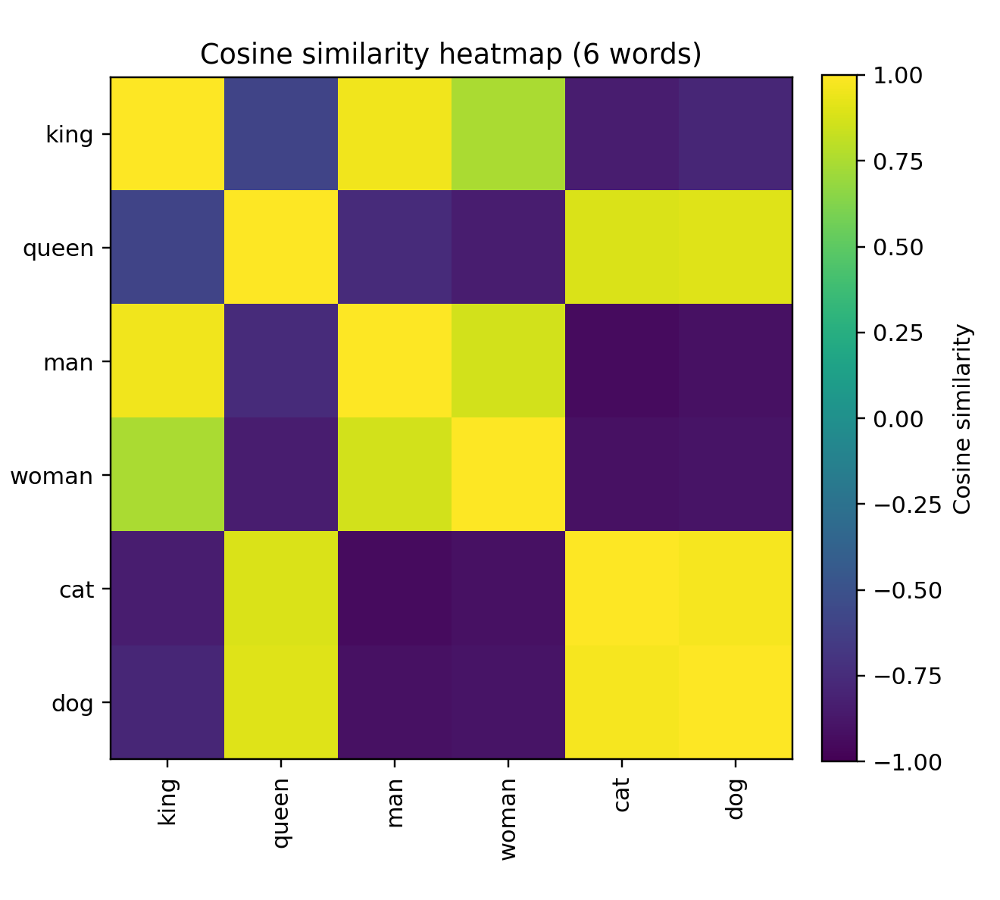
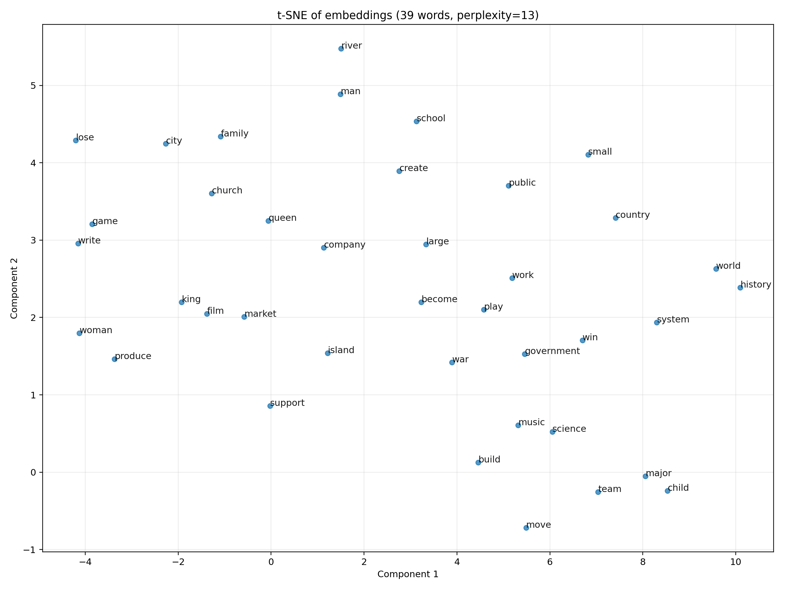
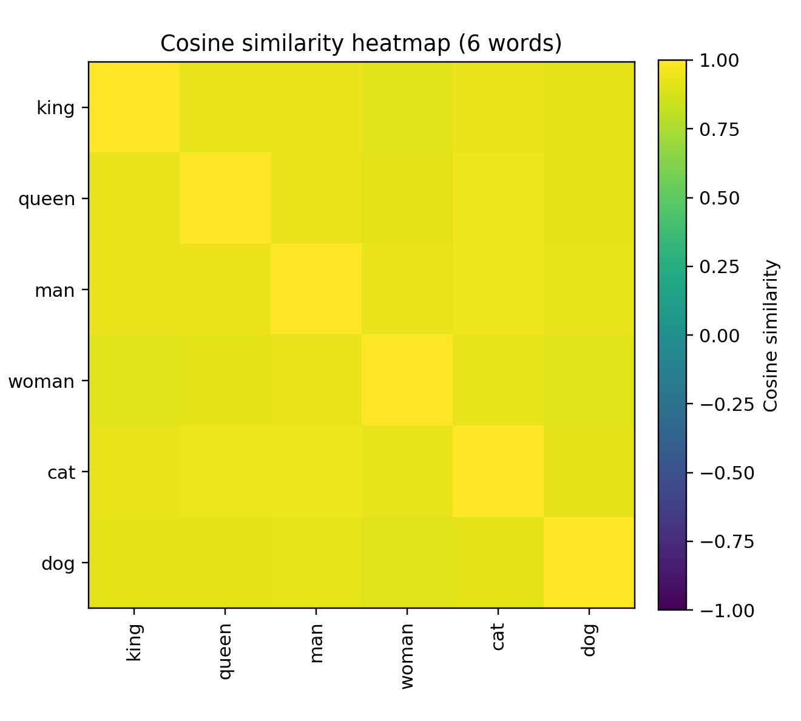
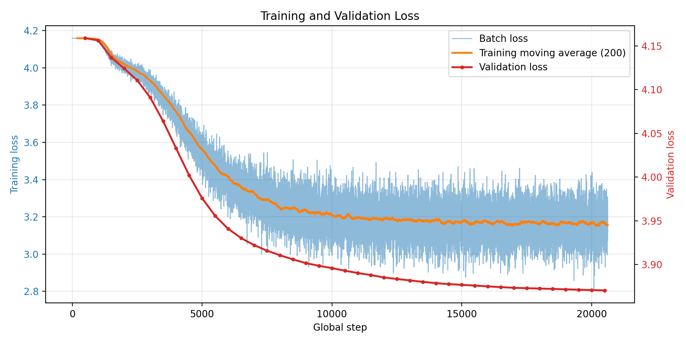

# Training Journey Notes

This note is not meant to replace the formal README. Instead, it records the practical training journey behind the current Word2Vec project: what was tried first, what seemed off, which questions came up during analysis, and why some runs were still valuable even when the embedding space was not yet where it needed to be.

If more detail is needed for any run, the most reliable source is the corresponding `run_config.json` inside that checkpoint folder.

## What is this note about?

In this project, training loss, held-out SGNS loss, and qualitative semantic quality do not always improve together.

Some runs were still useful because they made a failure mode easier to see:

- high-frequency words dominating the space
- semantic neighborhoods looking worse than the loss would suggest
- averaged embeddings hiding or distorting what was happening in `W_center` and `W_context`

The goal of this note is to document that process honestly.

## model_1: Early No-Subsampling Baseline

Checkpoint folder:

- `checkpoints/20260314_200105_7hr`

`model_1` is a good example of an early baseline that mattered mainly because it made the underlying problem visible.

Key characteristics from `run_config.json`:

- no explicit subsampling
- `max_vocab_size = 50000`
- `min_freq = 2`
- `num_negative_samples = 15`
- `learning_rate = 0.1`
- `window_size = 2`

Qualitative figures for `model_1`:

<table>
  <colgroup>
    <col style="width: 60%;">
    <col style="width: 40%;">
  </colgroup>
  <tr>
    <td align="center"><strong>Representative t-SNE</strong></td>
    <td align="center"><strong>6-word heatmap</strong></td>
  </tr>
  <tr>
    <td></td>
    <td></td>
  </tr>
</table>

What `model_1` helped reveal:

- the embedding space was heavily shaped by very frequent words
- many words appeared too close to one another
- qualitative plots suggested that the space was not forming clean semantic neighborhoods

## model_2: Validation-Aware Warm-Start Experiment

Checkpoint folder:

- `checkpoints/20260315_231058`

`model_2` represents a later stage, when the pipeline had already become more careful:

- smaller vocabulary
- subsampling enabled
- validation tracking enabled
- warm-start training from an earlier checkpoint

Key characteristics from `run_config.json`:

- `max_vocab_size = 10000`
- `min_freq = 5`
- `num_negative_samples = 5`
- `learning_rate = 0.02`
- `window_size = 2`
- `subsample_threshold = 1e-5`
- validation split and periodic validation loss
- warm start from `20260315_183537_con/final`

Qualitative figures for `model_2`:

<table>
  <colgroup>
    <col style="width: 60%;">
    <col style="width: 40%;">
  </colgroup>
  <tr>
    <td align="center"><strong>Representative t-SNE</strong></td>
    <td align="center"><strong>6-word heatmap</strong></td>
  </tr>
  <tr>
    <td></td>
    <td></td>
  </tr>
</table>

That question later became one of the main lessons of the project: SGNS loss and qualitative semantic structure can diverge, and looking only at the mean of `W_center` and `W_context` can give a misleading picture of what the model has actually learned.

## model_3: Later Stable Run

Checkpoint folder:

- `checkpoints/20260316_031132`

Status:

- completed later-stage run under the newer training pipeline

Qualitative figures for `model_3`:

<table>
  <colgroup>
    <col style="width: 60%;">
    <col style="width: 40%;">
  </colgroup>
  <tr>
    <td align="center"><strong>Representative t-SNE</strong></td>
    <td align="center"><strong>6-word heatmap</strong></td>
  </tr>
  <tr>
    <td></td>
    <td></td>
  </tr>
</table>

Training loss figure for `model_3`:

Comparison

- compared with `model_2`, `model_3` no longer showed the same collapse-like pattern in which many unrelated `W_center` neighbors had cosine values clustered near `0.999`
- this made the embedding space easier to inspect and suggests that the later preprocessing and training controls improved stability
- `model_3` also achieved the best training loss among the later-stage runs
- however, representative neighbors still remained too generic, and the semantic space was still qualitatively weak despite that stronger optimization result

What `model_3` shows is not that the problem is fully solved, but that the failure mode changed. The later pipeline reduced the earlier collapse-like behavior, and `model_3` reached the strongest training-loss result in the project so far. Even so, the embedding space still did not produce consistently clean semantic neighborhoods. That makes `model_3` a better endpoint than the earlier runs, but also a clear reminder that better optimization numbers do not automatically translate into better semantic structure.

## What Changed Over Time

The main changes across experiments:

- subsampling, added after it became clear that frequent words were dominating the space
- run-specific vocabulary saving, added so evaluation could be reproduced against the exact vocabulary used in training
- validation tracking, added to monitor held-out SGNS loss during training rather than relying only on training loss
- warm-start support, added to test continuation experiments from earlier checkpoints
- broader qualitative inspection, expanded through notebook probes, nearest neighbors, PCA, t-SNE, and cosine heatmaps
- stricter token filtering, added to remove low-signal tokens before training

## Current Position

At its current stage, the project can train SGNS word embeddings end to end in pure NumPy, save reproducible checkpoints, and support both quantitative and qualitative inspection of the learned space. It can also compare runs more reliably than the earliest versions of the pipeline, because vocabulary saving, validation tracking, checkpoint selection, and post-training analysis are now built into the workflow rather than added ad hoc.

What the project can do reasonably well:

- train and continue SGNS experiments in a controlled and reproducible way
- monitor optimization through training loss and held-out validation loss
- inspect learned representations through nearest neighbors, PCA, t-SNE, cosine heatmaps, and notebook-based probes
- reveal clear failure modes such as collapse, hubness, or high-frequency-word dominance

What the project still cannot do reliably:

- guarantee that a lower SGNS loss corresponds to better semantic neighborhoods
- produce consistently clean semantic groupings across runs without manual qualitative checking
- rely on a single embedding view, such as the mean of `W_center` and `W_context`, as a complete summary of model quality
- treat optimization performance alone as a reliable proxy for semantic quality, since later-stage runs such as `model_3` can achieve strong training loss while still learning a qualitatively weak embedding space