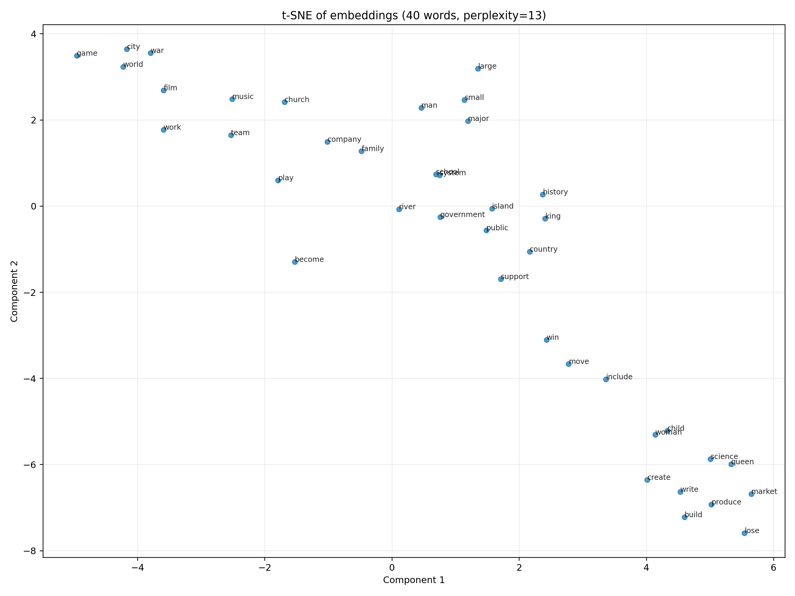

# Training Journey Notes

This note is not meant to replace the formal README. It records the practical training path behind the current Word2Vec project: what was tried first, what looked wrong, which questions came up during analysis, and why some runs were still useful even when the embedding space was not yet where it needed to be.

If more detail is needed for any run, the most reliable source is the corresponding `run_config.json` inside that checkpoint folder.

## Why This Note Exists

In this project, training loss, held-out SGNS loss, and qualitative semantic quality do not always move together.

Some runs were useful because they exposed a failure mode clearly:

- high-frequency words dominating the space
- semantic neighborhoods looking worse than the loss would suggest
- averaged embeddings hiding or distorting what was happening in `W_center` and `W_context`

The goal of this note is to document that process honestly.

## model_1: Early No-Subsampling Baseline

Checkpoint folder:

- `checkpoints/20260314_200105_7hr`

`model_1` is a good example of an early baseline that was important mainly because it made the problem visible.

Key characteristics from `run_config.json`:

- no explicit subsampling
- `max_vocab_size = 50000`
- `min_freq = 2`
- `num_negative_samples = 15`
- `learning_rate = 0.1`
- `window_size = 2`

What `model_1` helped reveal:

- the embedding space was heavily influenced by very frequent words
- many words looked too close to each other
- qualitative plots suggested that the space was not forming clean semantic neighborhoods

This did not make `model_1` useless. On the contrary, it established a clear baseline and showed why subsampling and tighter vocabulary control were needed.

Illustrative figure from `model_1`:

The figure is not presented as a benchmark result. It is included because it captures the practical impression from that stage: the space did not look cleanly organized enough to trust semantic nearest neighbors.

## model_2: Validation-Aware Warm-Start Experiment

Checkpoint folder:

- `checkpoints/20260315_231058`

`model_2` represents a later stage where the pipeline was already more careful:

- smaller vocabulary
- subsampling enabled
- validation tracking enabled
- warm-start training from an earlier checkpoint

Key characteristics from `run_config.json`:

- `max_vocab_size = 10000`
- `min_freq = 5`
- `num_negative_samples = 5`
- `learning_rate = 0.02`
- `window_size = 2`
- `subsample_threshold = 1e-5`
- validation split and periodic validation loss
- warm start from `20260315_183537_con/final`

Why `model_2` still mattered even though it was not the final answer:

- it showed a more disciplined training setup than the earliest runs
- it made loss tracking more informative
- it raised an important question: why can the numbers look better while the semantic neighborhoods still feel wrong?

That question turned out to be important. Later analysis showed that SGNS loss and qualitative semantic structure can diverge, and that looking only at the mean of `W_center` and `W_context` can be misleading.

In other words, `model_2` was useful not because it solved the problem completely, but because it made the next problem easier to identify.

## What Changed Over Time

Across experiments, the project gradually moved from a simple training script toward a more inspectable workflow:

- added subsampling after seeing that frequent words were dominating the space
- saved run-specific vocabularies for reproducible evaluation
- added validation tracking for held-out SGNS loss
- added warm-start support for continuation experiments
- expanded qualitative inspection through notebook probes, nearest neighbors, PCA, t-SNE, and cosine heatmaps
- added stricter token filtering to reduce low-signal tokens in the training data

These additions did not make every later run automatically good, but they made the experiments easier to interpret.

## Current Position

The current project is in a more mature state than the earliest runs, but the central lesson remains:

- lower loss is useful
- lower loss is not sufficient
- qualitative embedding checks are still necessary

For that reason, the project now treats both kinds of evidence as important:

- optimization-oriented evidence such as training and validation SGNS loss
- representation-oriented evidence such as nearest neighbors, analogy probes, and geometry diagnostics

## model_3: Later Stable Run

Checkpoint folder:

- `checkpoints/20260316_031132`

Status:

- completed later-stage run under the newer training pipeline

Small conclusion for now:

- compared with `model_2`, `model_3` no longer showed the same collapse-like pattern where many unrelated `W_center` neighbors had cosine values clustered near `0.999`
- this made the embedding space easier to inspect and suggests that the later preprocessing and training controls improved stability
- however, representative neighbors remained too generic, which indicates that the model was still strongly influenced by broad contextual overlap and frequency effects
- the main lesson from `model_3` is that the later pipeline improved the earlier failure mode, but did not yet produce consistently clean semantic neighborhoods

## Closing Note

Looking back, these three models are enough to explain most of the project.

`model_1` made the problem obvious: without enough control over frequent words, the embedding space was difficult to trust. `model_2` showed that adding more structure to training and evaluation made the results easier to reason about, even if the semantic quality was still not where it needed to be. `model_3` was the clearest sign of progress. It no longer looked collapsed in the same way as the earlier experiment, but it also made it clear that generic neighbors were still a real limitation.

So the overall story is not that one final run suddenly solved everything. It is that each stage exposed a different part of the problem, and the training pipeline became more interpretable because of that process. By the end, the model was meaningfully better than the early baseline, but qualitative checks were still necessary to understand what had actually improved and what had not.
